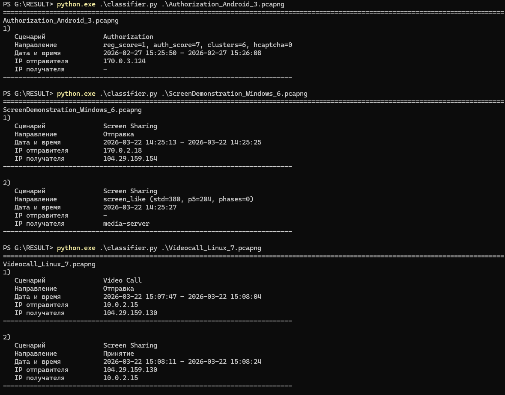
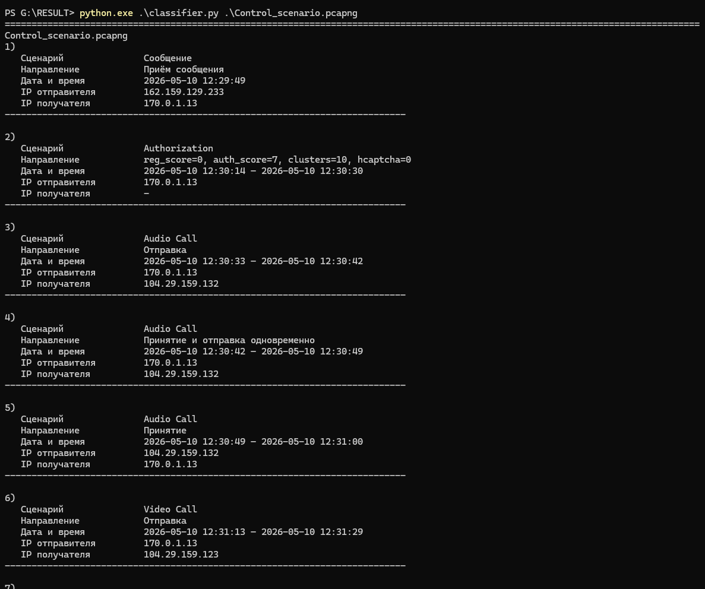
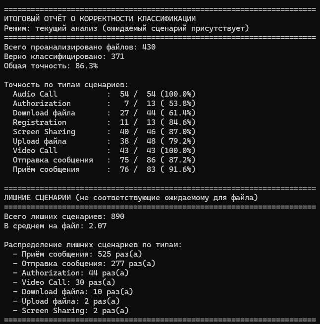

## Оценка точности классификации

Классификатор проверялся на наборе из **430 одиночных** pcap‑файлов, каждый из которых содержит трафик только одного целевого сценария.  
Файлы захватов доступны по ссылке [Google Drive](https://drive.google.com/drive/folders/1TIP_d6KAjXD8yRhUqJ-RhsE4GsOd7j9Q?usp=drive_link).  

*Пример классификации Discord на одиночных сценариях-файлах*

*Пример классификации Discord на мультисценарных файлах*

> Для мультисценарных захватов классификатор корректно обнаруживает все задуманные и фактически происходящие сценарии, за исключением ложных классификаций сообщений, связанных со служебным обменом приложения. 

### Режимы оценки

- **Текущий анализ (режим 1):** файл считается верно классифицированным, если в нём найдена метка ожидаемого сценария.
- **Чистый анализ (режим 2):** файл считается верно классифицированным, если ожидаемый сценарий присутствует **и** количество посторонних меток (не соответствующих ожидаемому) не превышает двух.

### Сводная таблица точности

| Сценарий               | Всего файлов | Верно (режим 1) | Точность (режим 1) | Верно (режим 2) | Точность (режим 2) |
|------------------------|--------------|---------------|-------------------|---------------|-------------------|
| Audio Call             | 54           | 54            | 100.0%            | 52            | 96.3%             |
| Authorization          | 13           | 7             | 53.8%             | 6             | 46.2%             |
| Download файла         | 44           | 27            | 61.4%             | 23            | 52.3%             |
| Registration           | 13           | 11            | 84.6%             | 11            | 84.6%             |
| Screen Sharing         | 46           | 40            | 87.0%             | 39            | 84.8%             |
| Upload файла           | 48           | 38            | 79.2%             | 38            | 79.2%             |
| Video Call             | 43           | 43            | 100.0%            | 43            | 100.0%            |
| Отправка сообщения     | 86           | 75            | 87.2%             | 10            | 11.6%             |
| Приём сообщения        | 83           | 76            | 91.6%             | 41            | 49.4%             |
| **Общая**              | **430**      | **371**       | **86.3%**         | **263**       | **61.2%**         |

### Статистика лишних меток

Общее количество лишних меток (не совпадающих с ожидаемым сценарием): **890**  
Среднее количество на файл: **2.07**

| Тип лишнего сценария | Количество |
|----------------------|------------|
| Приём сообщения      | 525        |
| Отправка сообщения   | 277        |
| Authorization        | 44         |
| Video Call           | 30         |
| Download файла       | 10         |
| Upload файла         | 2          |
| Screen Sharing       | 2          |

*Пример рассчета корректности классификации*
### Выводы
Несмотря на низкие показатели корректности для некоторых одиночных захватов, классификатор корректно работает на мультисценарных файлах и успешно обнаруживает все фактически присутствующие сценарии.
Лишние классификации сообщений обусловлены обменом служебной информации.